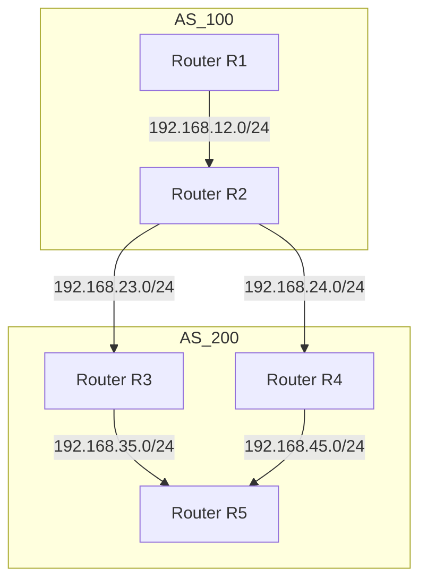

# topology

```mermaid
graph TD
    subgraph AS_100
        R1[Router R1] -- 192.168.12.0/24 --> R2[Router R2]
    end

    subgraph AS_200
        R2[Router R2] -- 192.168.23.0/24 --> R3[Router R3]
        R2[Router R2] -- 192.168.24.0/24 --> R4[Router R4]
        R3[Router R3] -- 192.168.35.0/24 --> R5[Router R5]
        R4[Router R4] -- 192.168.45.0/24 --> R5[Router R5]
    end
```
