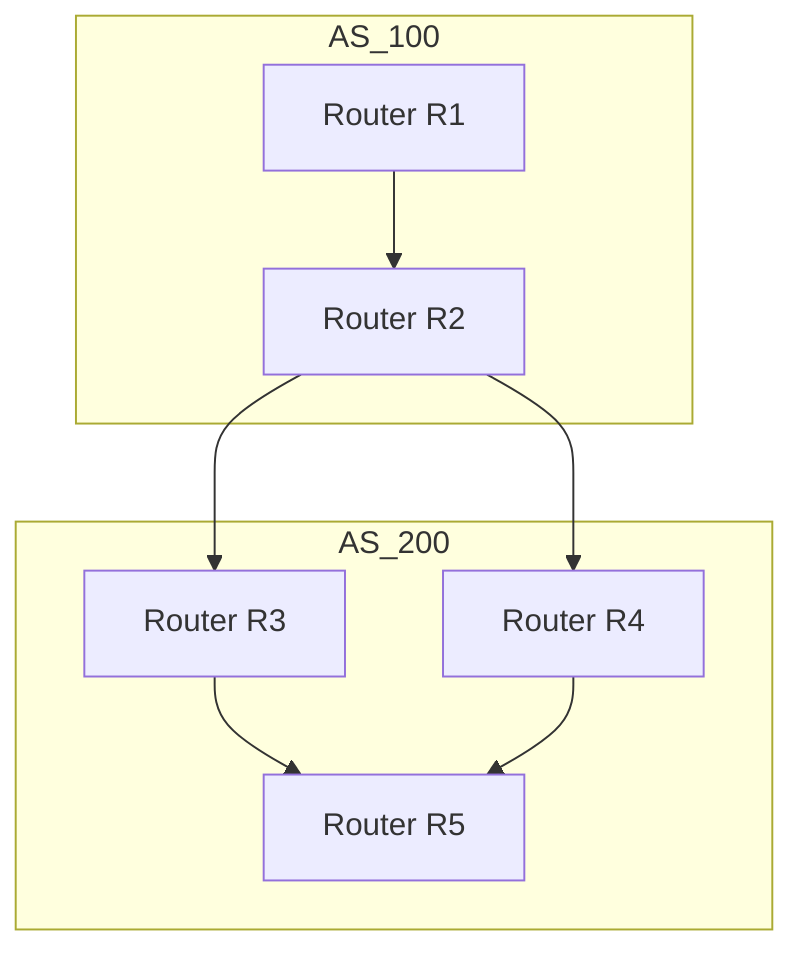

# topology

```mermaid
graph
    subgraph AS_100
        R1[Router R1] --> R2[Router R2]
    end

    subgraph AS_200
        R2[Router R2] --> R3[Router R3]
        R2[Router R2] --> R4[Router R4]
        R3[Router R3] --> R5[Router R5]
        R4[Router R4] --> R5[Router R5]
    end
```
