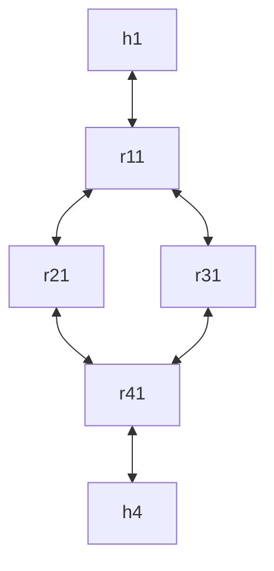

# bgpmgmtd 使用示例

## 如何部署

推荐使用 ubuntu2204

1. 安装 [containerlab](https://containerlab.dev/)，[docker](https://www.docker.com/)，[git](https://git-scm.com/)
2. clone 本仓库以及 [添加了新功能的 frr 仓库](https://github.com/ChocoLZS/frr)
3. build frr 仓库
   [官方 build 教程](https://docs.frrouting.org/projects/dev-guide/en/latest/building-frr-for-ubuntu2204.html#building-installing-frr)

```bash
git clone https://github.com/ChocoLZS/frr.git
cd frr
./bootstrap.sh
./configure \
    --prefix=/usr \
    --includedir=\${prefix}/include \
    --bindir=\${prefix}/bin \
    --sbindir=\${prefix}/lib/frr \
    --libdir=\${prefix}/lib/frr \
    --libexecdir=\${prefix}/lib/frr \
    --sysconfdir=/etc \
    --localstatedir=/var \
    --with-moduledir=\${prefix}/lib/frr/modules \
    --enable-configfile-mask=0640 \
    --enable-logfile-mask=0640 \
    --enable-snmp=agentx \
    --enable-multipath=64 \
    --enable-user=frr \
    --enable-group=frr \
    --enable-vty-group=frrvty \
    --with-pkg-git-version \
    --with-pkg-extra-version=-MyOwnFRRVersion
make -j${nproc} # 此步骤可忽略，可以编译检测代码问题
# 由于我们需要使用containerlab测试，所以直接build docker镜像就好
sudo docker build -f docker/alpine/Dockerfile -t frr-bgpmgmtd .
# 编译完镜像后在当前目录即
# frr-utilities/containerlab/topo/bgp/bgpmgmtd-multias-bfd
sudo clab deploy --reconfigure
```

相关 docker compose 规则，如端口映射，volume 挂载，不在本文讨论范围之内，请根据需要进行配置。

## 拓扑


